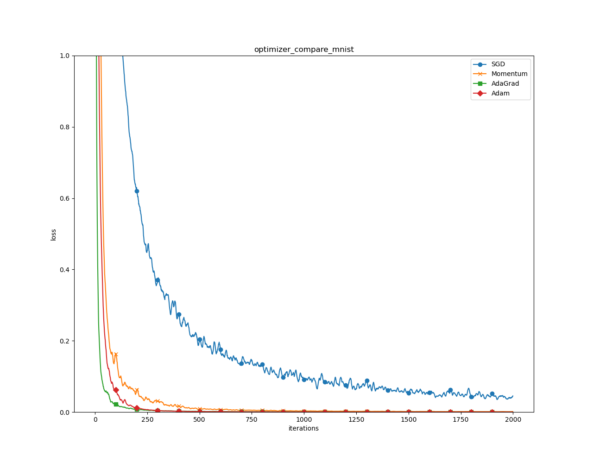

## <center>Homework Programming Assignment 5</center>

<center>Dohun Kim 2018115809</center>


#### 1. Code Structure

 코드는 크게 4 가지 부분으로 나누어 작성하였습니다. 
1. 필요한 패키지 import
2. `Chap06.ipynb` 내용 구현 함수
3. 데이터 셋 전처리 및 반환 함수
4. main 실행 로직

 `hw5-1.py`와 `hw5-2.py`에서 3 번의 데이터 로딩 함수만 각각 Fashion MNIST, scikit-learn digits로 다르고, 나머지 1, 2, 4 번에 해당하는 부분의 코드는 동일하게 사용할 수 있도록 일반화하였습니다.

```python
############################## import required packages ##############################
import numpy as np
import matplotlib.pyplot as plt
# and more imports...

################################## define functions ##################################
def weakness_of_sgd():
    pass
def optimizer_compare_naive():
    pass
# and more functions...

############################# define data loader function ############################
def load_fashion_mnist(normalize=True):
    pass
# or
def load_sklearn_digits(normalize=True):
	pass

######################################## main ########################################
if __name__ == '__main__':
    # run functions (defined in second section)
	pass
```

 `Chap06.ipynb`의 모든 내용을 markdown 블록 없이 `.py`코드로 작성해야 하는 상황이므로, 최대한 기존의 코드를 그대로 유지하면서, 주제 별로 코드의 구분을 짓기 위해 함수의 단위로 감싸주었습니다.

 데이터 로딩 함수인 `load_fashion_mnist()`와 `load_sklearn_digits()` 또한 기존 `Chap06.ipynb`의 `load_mnist()`의 입출력 형식에 맞추어 작성하여 `load_mnist()`를 사용하였던 자리에 그대로 대체하여 사용할 수 있게 하였습니다.


#### 2. Functions

 `Chap06.ipynb`의 내용을 주제 별로 정리하여 다음의 8 개의 함수를 정의하였습니다.

```python
def weakness_of_sgd():
    '''6.1.3 SGD의 단점'''
    pass

def optimizer_compare_naive():
    '''6.1.7 어느 갱신 방법을 이용할 것인가?'''
	pass

def optimizer_compare_real_data(data_loader):
    '''6.1.8 MNIST 데이터셋으로 본 갱신 방법 비교'''
    pass

def weight_init_activation_histogram():
    '''6.2.2 은닉층의 활성화값 분포'''
    pass

def batch_norm_test(data_loader):
    '''6.3.2 배치 정규화의 효과'''
    pass

def overfit_weight_decay(data_loader):
    '''6.4.1 오버피팅'''
    pass

def overfit_dropout(data_loader):
    '''6.4.3 드롭아웃'''
    pass

def hyperparameter_optimization(data_loader):
    '''6.5.3 하이퍼파라미터 최적화 구현하기'''
    pass
```

 데이터 셋에 독립적인 주제의 경우 입력 매개변수가 없는 함수로 구현하였고, 데이터 셋이 필요한 주제의 경우 함수를 일급 객체로 취급하는 파이썬의 특징을 활용해 입력 매개변수로 데이터 로딩 함수를 전달하여 사용하도록 구현하였습니다. 이를 통해 사용할 데이터 셋을 바꾸더라도 위의 8 개의 함수의 코드를 직접 변경하지 않고, 새로운 데이터 셋에 대한 함수만 정의하여 이 함수를 넘겨주도록 할 수 있습니다.

```python
####################################### 기존 코드 ######################################
from dataset.mnist import load_mnist
(x_train, t_train), (x_test, t_test) = load_mnist(normalize=True)

###################################### 일반화한 함수 ####################################
def optimizer_compare_real_data(data_loader):
    '''6.1.8 MNIST 데이터셋으로 본 갱신 방법 비교'''
    (x_train, t_train), (x_test, t_test) = data_loader(normalize=True)
    
if __name__ == '__main__':
    optimizer_compare_real_data(load_fashion_mnist)
    # or
    optimizer_compare_real_data(load_sklearn_digits)
```


 각 함수들은 실행의 결과로 plot figure를 띄우게 되는데, 기존의 `.ipynb` 환경에서는 inline으로 출력 되어 plot을 코드 블록, markdown 블록과 함께 읽을 수 있었으므로, 거의 모든 figure에 title이 없었습니다. 하지만 지금은 `.py` 파일로 실행하여 figure가 새로운 창에서 열리게 되므로 각각의 figure에 `plt.title()` 또는 `plt.suptitle()`을 통해 title을 지정해주어 figure만 보고도 무엇을 실행한 결과인지 알 수 있도록 하였습니다. 또한, 기존 코드에서 같은 코드를 조금씩 바꾸어 여러 번 실행하는 부분을 반복문으로 간소화하였습니다.

```python
####################################### 기존 코드 ######################################
# more codes here...

w = np.random.randn(node_num, node_num) * 0.01
activations = get_activation(hidden_layer_size, x, w, z)
get_histogram(activations)

w = np.random.randn(node_num, node_num) * np.sqrt(1.0 / node_num)
activations = get_activation(hidden_layer_size, x, w, z)
get_histogram(activations)
# 이와 같은 패턴의 코드가 총 6번이 반복된다.

###################################### 간소화한 코드 ####################################
def weight_init_activation_histogram():
    # more codes here...
    
    vals = {'std=1':1, 
            'std=0.01':0.01,
            'Xavier':np.sqrt(1.0 / node_num),
            'He':np.sqrt(2.0 / node_num)}

    cases = [(sigmoid, 'std=1'), (sigmoid, 'std=0.01'), (sigmoid, 'Xavier'),
             (ReLU, 'std=0.01'), (ReLU, 'Xavier'), (ReLU, 'He')]

    for z, key in cases:
        suptitle = z.__name__ + ' ' + key
        w = np.random.randn(node_num, node_num) * vals[key]
        activations = get_activation(hidden_layer_size, x, w, z)
        get_histogram(activations, suptitle)
```

 또한 뉴럴 네트워크 모델의 입출력 크기로 784, 10과 같은 고정된 값 대신, 데이터 로딩 함수가 반환한 데이터의 크기에 맞춰서 가변적인 값을 사용하도록 변경하였습니다.

```python
####################################### 기존 코드 ######################################
network = MultiLayerNet(input_size=784, 
                        hidden_size_list=[100, 100, 100, 100, 100, 100], 
                        output_size=10,
                        weight_decay_lambda=weight_decay_lambda)

###################################### 변경한 코드 #####################################
input_size  = x_train.shape[1]
output_size = len(np.unique(t_train, axis=0))

network = MultiLayerNet(input_size=input_size, 
                        hidden_size_list=[100, 100, 100, 100, 100, 100], 
                        output_size=output_size,
                        weight_decay_lambda=weight_decay_lambda)
```


#### 3. Data Loaders

 먼저, Fashion MNIST 데이터 셋을 불러오는 `load_fashion_mnist()` 함수는 교재에서 제공하는 코드 중 `dataset` 폴더의 `mnist.py` 파일의 내용에서 데이터의 url 주소만 일부 변경하여 구현하였습니다. 

 다음으로 scikit-learn의 digits 데이터 셋을 불러오는 `load_sklearn_digits()` 함수는 scikit-learn 패키지의 `load_digits()` 함수를 사용하여 원본 데이터를 받은 후 train-test spilt, normalization 등을 수행하여 데이터를 반환합니다. split 방법은 지난주 과제에서 다룬 클래스 별 비율을 유지하는 방법을 적용하였습니다. 두 함수 모두 기존의 `load_mnist()` 함수와 입출력 형식을 동일하게 맞추어 작성하였습니다.

```python
############################# define data loader function ############################

def load_sklearn_digits(normalize=True):
    
    # load data from gzip files
    x, t = load_digits(return_X_y=True)

    # normalization of input data
    if normalize:
        x = x / x.max()

    # shuffle data randomly
    x, t = shuffle_dataset(x, t)

    # split dataset into training(80%) and test(20%) sets
    train_rate = 0.8
    labels = np.unique(t, axis=0).tolist()

    train_idx, test_idx = [], []

    for label in labels:
        all_idx = list(np.where(t == label)[0])
        num_train = int(len(all_idx) * train_rate)

        train_idx += all_idx[:num_train]
        test_idx  += all_idx[num_train:]

    x_train, t_train = x[train_idx], t[train_idx]
    x_test,  t_test  = x[test_idx],  t[test_idx]

    x_train, t_train = shuffle_dataset(x_train, t_train)

    return (x_train, t_train), (x_test, t_test)
```


#### 4. main

 앞서 정의한 함수들과 그 함수의 데이터 로딩 함수 사용 여부를 짝지어 리스트로 저장해두고, 반복문을 실행하여 함수들을 차례대로 실행합니다. 여기서 `hw5-1.py`와 `hw5-2.py`의 차이는 중간의 `data_loader`를 어떤 함수로 지정하는 가입니다. 사용하는 데이터 셋이 Fashion MNIST인지 scikit-learn digits인지에 따라서 `load_fashion_mnist` 또는 `load_sklearn_digits` 둘 중 하나를 지정하기만 하면 다른 모든 코드에 적용이 됩니다.

```python
######################################## main ########################################

if __name__ == '__main__':

    funcs = [
        (weakness_of_sgd, False),
        (optimizer_compare_naive, False),
        (optimizer_compare_real_data, True),
        (weight_init_activation_histogram, False),
        (batch_norm_test, True),
        (overfit_weight_decay, True),
        (overfit_dropout, True),
        (hyperparameter_optimization, True)
    ]

    data_loader = load_fashion_mnist
	# or
    data_loader = load_sklearn_digits

    for f, use_data_loader in funcs:
        print('running ' + f.__name__ + '() ...')
        if use_data_loader:
            f(data_loader)
        else:
            f()
        print()
```


#### 5. Execution Results

| hw5-1.py                | hw5-2.py                |
| ----------------------- | ----------------------- |
|    |    |
|    |    |
|    |    |
|    |    |
|    |    |
|    |    |
|    |    |
|    |    |
|    |    |
|  |  |
|  |  |
|  |  |
|  |  |
|  |  |
|  |  |
