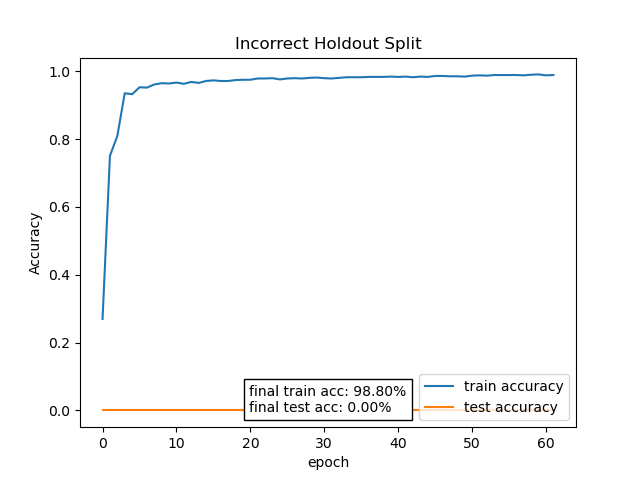
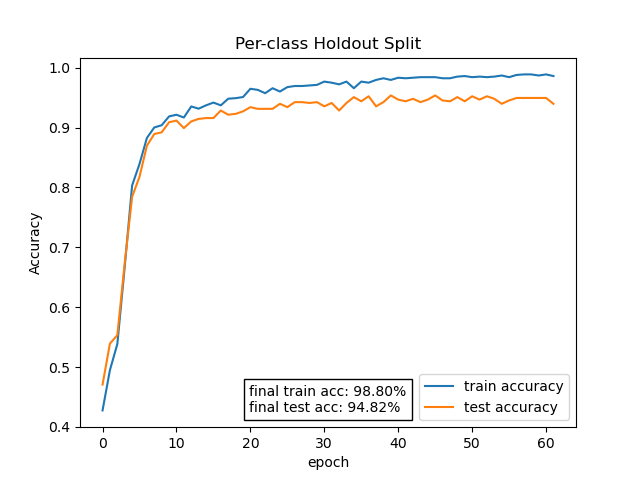
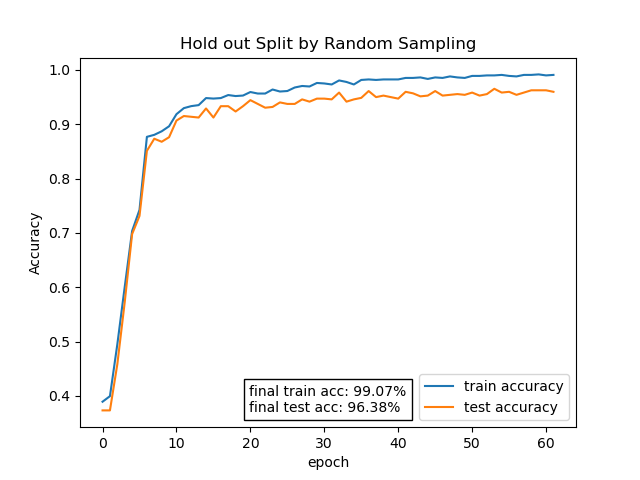
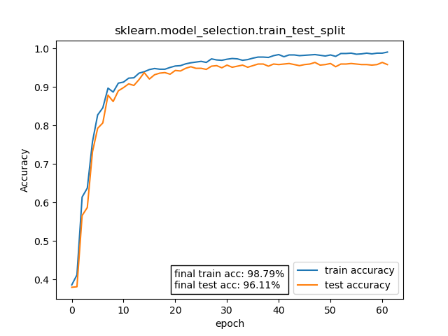
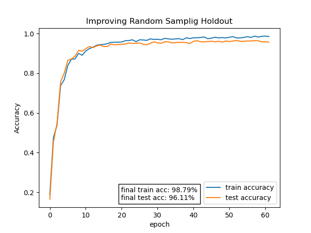
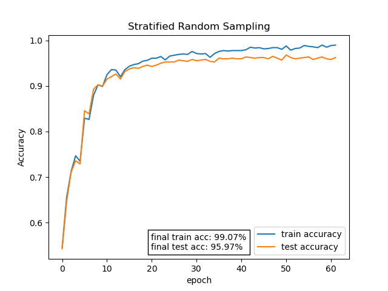
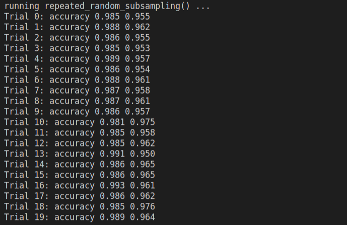
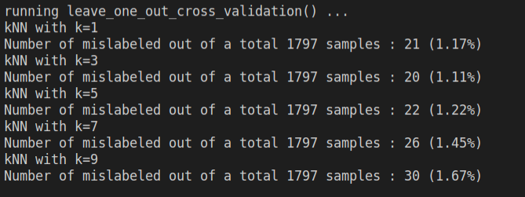

## <center>Homework Programming Assignment 6</center>

<center>Dohun Kim 2018115809</center>


#### 1. Code Structure

 코드는 크게 4 가지 부분으로 나누어 작성하였습니다. 
1. 필요한 패키지 import
2. `TwoLayerNet` 모델과 학습 관련 함수
3. `datasplit.ipynb` 내용 구현 함수
4. main 실행 로직

```python
############################## import required packages ##############################
import numpy as np
import matplotlib.pyplot as plt
# and more imports...

#################################### define model ####################################
class TwoLayerNet:
	pass

def train_neuralnet_data(...):
    pass

def plot_history(history, title):
    pass

################################## define functions ##################################
def incorrect_holdout_split(data_loader):
    pass

def per_class_holdout_split(data_loader):
    pass
# and more functions

######################################## main ########################################
if __name__ == '__main__':
    # run functions (defined in third section)
	pass
```

 `datasplit.ipynb`의 모든 내용을 markdown 블록 없이 `.py`코드로 작성해야 하는 상황이므로, 최대한 기존의 코드를 그대로 유지하면서, 주제 별로 코드의 구분을 짓기 위해 함수의 단위로 감싸주었습니다.

 `datasplit.ipynb`에서는 IRIS 데이터셋을 사용하기 위해 scikit-learn의 `load_iris()` 함수를 사용하는데, 여기서는 digits 데이터셋을 사용해야 하므로 기존의 `load_iris()` 함수의 자리를 `load_digits()` 함수로 대체합니다. 이를 일반화하기 위해 해당 위치에 들어갈 함수를 `data_loader`라는 매개변수로 입력받아 실행하게 작성하였습니다.


#### 2. Functions

 `datasplit.ipynb`의 내용을 주제 별로 정리하여 다음의 7 개의 함수를 정의하였습니다.

```python
def incorrect_holdout_split(data_loader):
    '''Incorrect Holdout Split'''
    pass

def per_class_holdout_split(data_loader):
    '''Per-class Holdout Split'''
    pass

def random_sampling_holdout_split(data_loader):
    '''Holdout Split by Random Sampling'''
    pass

def sklearn_train_test_split(data_loader):
    '''sklearn.model_selection.train_test_split'''
    '''Improving Random Sampling Holdout'''
    pass

def stratified_random_sampling(data_loader):
    '''Stratified Random Sampling'''
	pass

def repeated_random_subsampling(data_loader):  
    '''Repeated Random Subsampling'''
    pass

def leave_one_out_cross_validation(data_loader):
    '''LOO (leave-one-out) cross validation, k nearest neighbors on given dataset'''
    pass
```

 함수를 일급 객체로 취급하는 파이썬의 특징을 활용해 입력 매개변수로 데이터 로딩 함수를 전달하여 사용하도록 구현하였습니다. 이를 통해 사용할 데이터 셋을 바꾸더라도 위의 7 개의 함수의 코드를 직접 변경하지 않고, 새로운 데이터 셋에 대한 함수만 정의하여 이 함수를 넘겨주도록 할 수 있습니다.

```python
####################################### 기존 코드 ######################################
from sklearn import datasets

iris = datasets.load_iris()

###################################### 일반화한 코드 ####################################
from sklearn.datasets import load_digits

def incorrect_holdout_split(data_loader):
    '''Incorrect Holdout Split'''
    X, y = data_loader(return_X_y=True)
    
if __name__ == '__main__':
    incorrect_holdout_split(load_digits)
```


 기존의 `datasplit.ipynb`에서는 모델들의 학습 결과를 그래프로 나타내지 않고 명령창에 정확도 값을 출력하기만 했습니다. 하지만 데이터를 분할하는 여러가지 방법들을 직접 비교하기 위해서는 각 모델들의 학습 곡선을 그래프로 나타내는 것이 더 명확할 것이라고 판단하였습니다. 따라서 `train_neuralnet_data()` 함수의 반환 값으로 학습 도중의 정확도 평가 기록들과 학습 완료 후의 정확도 값을 모두 저장한 `history` 딕셔너리를 반환하도록 함수를 수정하였습니다.

```python
####################################### 기존 코드 ######################################
def train_neuralnet_iris(...):
    # train loop here...
    
    tracc = network.accuracy(x_train, t_train)
    teacc = network.accuracy(x_test, t_test)
    # print train result...
    
    return tracc, teacc

###################################### 수정한 코드 #####################################
def train_neuralnet_data(...):
    # train loop here...
    
    tracc = network.accuracy(x_train, t_train)
    teacc = network.accuracy(x_test, t_test)
	# print train result...
    
    history = {
        'train_acc': train_acc_list,
        'test_acc': test_acc_list,
        'final_train_acc': tracc,
        'final_test_acc': teacc
    }

    return history
```

 또한 이 `history` 딕셔너리 값을 바탕으로 학습 곡선을 그리는 함수를 정의하였습니다.

```python
###################################### 추가한 코드 #####################################
def plot_history(history, title):

    # plot learning curve by accuracy
    plt.plot(history['train_acc'], label='train accuracy')
    plt.plot(history['test_acc'], label='test accuracy')

    # add test accuract in learning curve plot
    tracc = history['final_train_acc'] * 100
    teacc = history['final_test_acc'] * 100

    text = (f'final train acc: {tracc:.2f}%\n'
            + f'final test acc: {teacc:.2f}%')
    
    anchored_text = AnchoredText(text, loc='lower center')
    plt.gca().add_artist(anchored_text)

    plt.legend(loc='lower right')

    # set axis
    plt.title(title)
    plt.xlabel('epoch')
    plt.ylabel('Accuracy')
    plt.show()
```


 한편, IRIS 데이터셋과 scikit-learn digits 데이터셋의  구조상 발생하는 차이점이 있습니다. IRIS 데이터셋의 경우 데이터의 분포가 `setosa`, `versicolour`, `virginica` 순으로 정렬되어있는 상태이지만, scikit-learn digits 데이터셋은 0에서 9까지의 모든 데이터의 순서가 섞여있다는 점입니다. 따라서 scikit-learn digits 데이터셋을 HO1: Incorrect Holdout Split / HO2: Per-class Holdout Split / HO3: Holdout Split by Random Sampling 의 세가지 예제에 그대로 적용하면 의도한 실행 결과가 도출되지 않을 것입니다. HO3의 경우 무작위 추출이므로 정렬 여부가 크게 영향을 미치지 않을 것이라고 예상되지만, HO1, HO2과의 직접적인 비교를 위해 세가지 방법 모두 데이터를 미리 정렬하도록 하였습니다.

```python
def incorrect_holdout_split(data_loader):
    
    '''Incorrect Holdout Split'''

    X, y = data_loader(return_X_y=True)

    idx = np.argsort(y)    # sort data by label value 
    X, y = X[idx], y[idx]  # to do the same method as the example
    
    # and more codes...
```

 또한, HO2의 경우 기존의 코드에서는 IRIS 데이터셋이 각각의 label을 50개씩 동일하게 포함하고 있다는 사실을 바탕으로 test data의 index 배열을 생성하였습니다. 하지만 digits 데이터셋의 경우 각각의 label 마다 데이터의 개수가 서로 다르기 때문에 이를 반영한 새로운 코드를 작성하였습니다.

```python
####################################### 기존 코드 ######################################
# more codes here...

ntestsamples = len(iris.target) * 4 // 10
ntestperclass = ntestsamples // 3

Bte = np.zeros(len(iris.target),dtype=bool)
for c in range(0,3): Bte[range(c*50,c*50+ntestperclass)] = True

train_neuralnet_iris(iris.data[~Bte,:], iris.target[~Bte],
                     iris.data[Bte,:], iris.target[Bte], ...)

###################################### 수정한 코드 #####################################
def per_class_holdout_split(data_loader):
    # more codes here...
    
    nsamples = X.shape[0]
    _, counts = np.unique(y, return_counts=True)
    Bte = np.zeros(nsamples, dtype=bool)
    
    idx = 0
    for count in counts:
        ntestsample = int(count * 0.4)
        Bte[idx:idx+ntestsample] = True
        idx += count
    
    history = train_neuralnet_data(X[~Bte,:], y[~Bte], X[Bte,:], y[Bte], ...)
    
    plot_history(history, 'Per-class Holdout Split')
```


#### 3. main

 앞서 정의한 함수들을 리스트로 저장해두고, 반복문을 실행하여 함수들을 차례대로 실행합니다. 

```python
######################################## main ########################################

if __name__ == '__main__':
    
    funcs = [
        incorrect_holdout_split,
        per_class_holdout_split,
        random_sampling_holdout_split,
        sklearn_train_test_split,
        stratified_random_sampling,
        repeated_random_subsampling,
        leave_one_out_cross_validation,
    ]

    data_loader = load_digits

    for f in funcs:
        print('running ' + f.__name__ + '() ...')
        f(data_loader)
        print()
```


#### 4. Hyperparameters

 본 과제의 목적은 여러가지 데이터 분할 방법을 서로 비교해보기 위함이므로, 모든 모델의 하이퍼 파라미터는 동일하게 설정하였습니다. 데이터셋이 바뀜에 따라 TwoLayerNet의 `input_size`와 `output_size`가 각각 4, 3에서 64, 10으로 커졌으며, 이에 비례하여 모델의 파라미터 개수 또한 함께 늘어납니다. 

 또한 전체 데이터의 양이 150개에서 1797개로 약 12배 늘어났기 때문에, 이에 맞추어 `batch_size`를 10에서 128로 늘려보았으나 `iter_per_epoch`가 8이 되어 필요 이상의 validation을 수행하므로, `batch_size`를 64로 정하였습니다. 

 `learning_rate`의 경우 기존의 0.1의 값을 사용하면 대부분의 경우 제대로 학습이 진행되지 않았습니다. 이는 IRIS 분류 문제에 비하여 digits 분류 문제의 복잡도가 더 높고, 모델의 복잡도 또한 파라미터의 개수가 더 많으므로, 문제를 풀기 위한 손실 함수도 더 복잡하기 때문일 것이라 예상합니다. 따라서 이에 맞추어 `learning_rate`의 값을 0.01로 줄였고, 학습에 실패하는 케이스는 발생하지 않게 되었습니다. 

 위와 같이 값을 설정해 모델들을 학습시키고 학습 곡선을 관찰하였을 때, 오버피팅이 발생하지 않고 test accuracy가 train accuracy를 계속 잘 따라 올라가는 추세를 확인할 수 있었습니다. 따라서 모델이 더 학습할 여지가 있다고 판단하였고, 정확도를 더 올리기 위해 `hidden_size` 를 10에서 50으로 늘려주었습니다. 이를 통해 최종 test accuracy 값이 93%~96%에서 95%~97%로 향상되었음을 확인하였습니다.


#### 5. Execution Results

|  |  |
| ------------------ | ------------------ |
|  |  |
|  |  |


|  |  |
| ------------------ | ------------------ |
|                    |                    |
