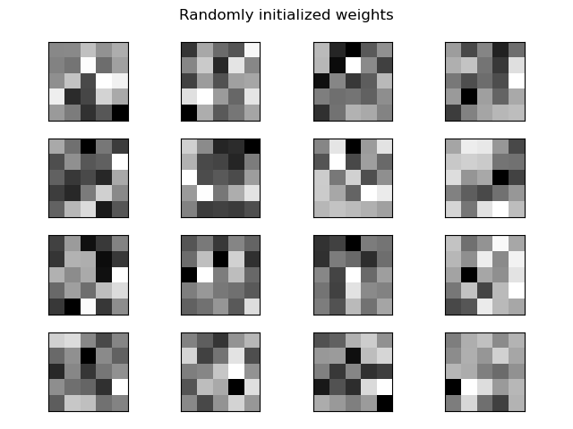

## <center>Homework Programming Assignment 6</center>

<center>Dohun Kim 2018115809</center>


#### 1. Simple ConvNet

```python
# 데이터 읽기
(x_train, t_train), (x_test, t_test) = load_mnist(flatten=False)

# 시간이 오래 걸릴 경우 데이터를 줄인다.
x_train, t_train = x_train[:5000], t_train[:5000]
x_test, t_test = x_test[:1000], t_test[:1000]

max_epochs = 20

network = SimpleConvNet(input_dim=(1,28,28), 
                        conv_param={'filter_num': 30, 'filter_size': 5, 
                                    'pad': 0, 'stride': 1},
                        hidden_size=100, output_size=10, weight_init_std=0.01)
                        
trainer = Trainer(network, x_train, t_train, x_test, t_test,
                  epochs=max_epochs, mini_batch_size=100,
                  optimizer='Adam', optimizer_param={'lr': 0.001},
                  evaluate_sample_num_per_epoch=1000)
```

 위의 코드는 강의자료의 예제 코드에서 사용한 하이퍼파라미터 값들이다. 기존 코드를 따라 그대로 실행하면 전체 mnist 데이터셋에 대해 학습하는데, 이는 훈련에 매우 긴 시간이 소요된다. 따라서 주석처리되어있던 데이터 수 줄이는 코드를 통해 5000개의 데이터만을 사용하기로 했다. 기존 하이퍼파라미터 설정 그대로 5000개의 일부 데이터로만 학습을 진행했을 때와 전체 데이터로 학습했을 때의 실행 결과는 아래와 같다. 왼쪽은 5000개의 데이터를 사용한 학습 곡선으로, 두 곡선이 점점 벌어지면서 오버피팅이 발생하는 것을 확인할 수 있다. 오른쪽은 전체 데이터를 사용한 학습으로, 시간이 길어 10번의 에포크만을 실행하였다. 데이터가 풍부한만큼 오버피팅이 덜 일어나며, 마지막 검증 정확도가 98.8%에 이르는 것을 확인할 수 있다.

| Small dataset | Full dataset |
|---|---|
|  |  |


| Small dataset | Full dataset |
| ------------------ | ------------------ |
|  |  |
|  |  |
|  |  |


##### Learning rate

 기존의 learning rate=0.001에서 2배와 1/2배의 값 두 가지를 실험해본 결과, 학습률이 0.002일 때 train, test 정확도 모두 향상되었으며, 결과 마지막 검증 정확도가 기존 95.7%에서 96.2%까지 개선되었음을 확인하였다.


| lr=0.002 | lr=0.0005 |
|------------|-------------|
|  |  |
|  |  |
|  |  |


 학습률을 높였을 때 정확도의 향상을 보였으므로 0.003, 0.004 두가지 값에 대해서도 시도를 해본 결과 둘 모두 97%로 0.002의 96.2%에 비해 높은 성적을 보여주는 것을 확인하였다. 비슷한 결과를 보여주므로 최종적으로 학습률을 0.003으로 사용하기로 결정하였다.


| lr=0.003 | lr=0.004 |
|------------|-------------|
|  |  |
|  |  |
|  |  |


#### 2. LeNet


```python
class LeNet:
    ''' LeNet
    conv - relu - pool - conv - relu - pool 
    - affine - relu - affine - relu - affine - softmax 
    
    input_size  = (1, 28, 28)
    hidden_size = [120, 84]
    output_size = 10
    '''
    
    def __init__(self, weight_init_std=0.01):

        # 가중치 초기화
        self.params = {}
        self.params['W1'] = weight_init_std * np.random.randn(6, 1, 5, 5)
        self.params['b1'] = np.zeros(6)
        
        self.params['W2'] = weight_init_std * np.random.randn(16, 6, 5, 5)
        self.params['b2'] = np.zeros(16)

        self.params['W3'] = weight_init_std * np.random.randn(400, 120)
        self.params['b3'] = np.zeros(120)

        self.params['W4'] = weight_init_std * np.random.randn(120, 84)
        self.params['b4'] = np.zeros(84)
        
        self.params['W5'] = weight_init_std * np.random.randn(84, 10)
        self.params['b5'] = np.zeros(10)

        # 계층 생성
        self.layers = OrderedDict()
        self.layers['C1'] = Convolution(self.params['W1'], self.params['b1'], pad=2)
        self.layers['Relu1'] = Relu()
        self.layers['S2'] = Pooling(pool_h=2, pool_w=2, stride=2)

        self.layers['C3'] = Convolution(self.params['W2'], self.params['b2'])
        self.layers['Relu2'] = Relu()
        self.layers['S4'] = Pooling(pool_h=2, pool_w=2, stride=2)

        self.layers['Affine1'] = Affine(self.params['W3'], self.params['b3'])
        self.layers['Relu3'] = Relu()
        self.layers['Affine2'] = Affine(self.params['W4'], self.params['b4'])
        self.layers['Relu4'] = Relu()
        self.layers['Affine3'] = Affine(self.params['W5'], self.params['b5'])

        self.last_layer = SoftmaxWithLoss()
    
    # continue on next page...
```


```python
    def gradient(self, x, t):
        # forward
        self.loss(x, t)

        # backward
        dout = 1
        dout = self.last_layer.backward(dout)

        layers = list(self.layers.values())
        layers.reverse()
        for layer in layers:
            dout = layer.backward(dout)

        # 결과 저장
        grads = {}
        grads['W1'], grads['b1'] = self.layers['C1'].dW, self.layers['C1'].db
        grads['W2'], grads['b2'] = self.layers['C3'].dW, self.layers['C3'].db
        grads['W3'], grads['b3'] = self.layers['Affine1'].dW, self.layers['Affine1'].db
        grads['W4'], grads['b4'] = self.layers['Affine2'].dW, self.layers['Affine2'].db
        grads['W5'], grads['b5'] = self.layers['Affine3'].dW, self.layers['Affine3'].db

        return grads
    
    # and more methods...
```


##### Execution result

|  |  |
|---------------------|---------------------|
|  |  |
