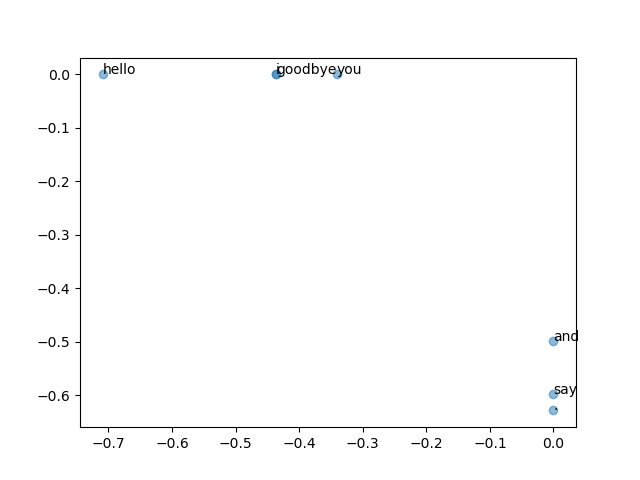
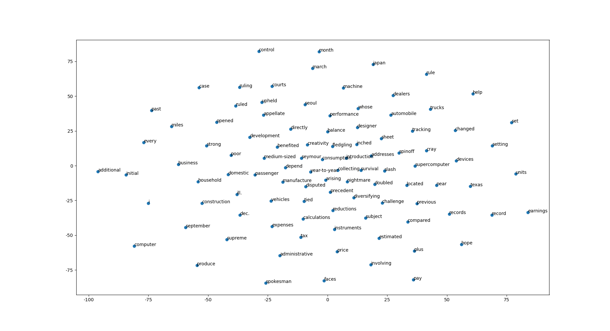
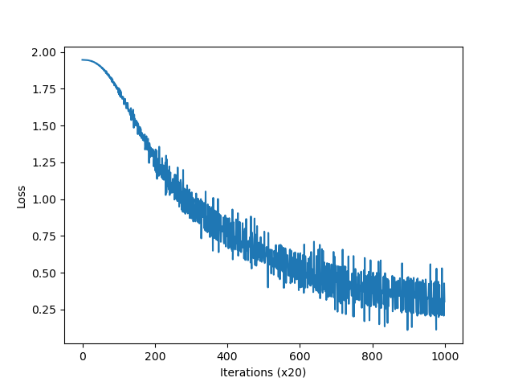
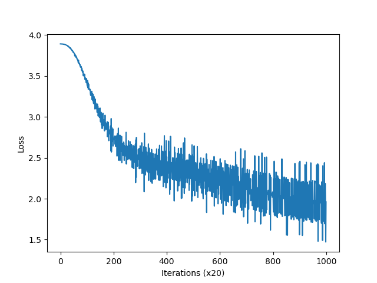
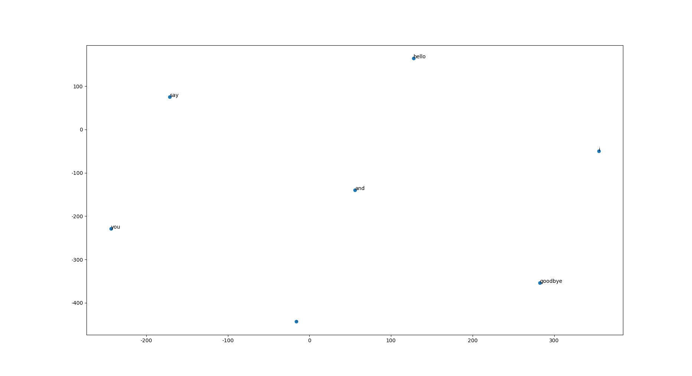
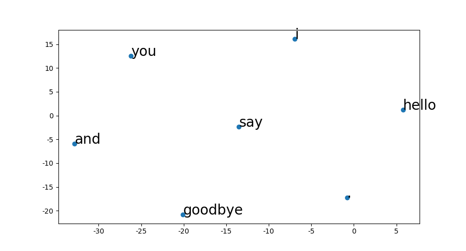

## <center>Homework Programming Assignment 9</center>

<center>Dohun Kim 2018115809</center>


#### Chapter 02. 자연어와 단어의 분산 표현

 Chapter 02 내용의 코드는 `hw9-1.py`로 통합되어있습니다.
```python
'''
hw9-1.py :
    Ch02. Natural Language and Distributional Representation
'''
```


##### 1-1) Preprocessing

```python
text = 'You say goodbye and I say hello.'
corpus, word_to_id, id_to_word = preprocess(text)

print(f'corpus: {corpus}')          # f: {corpus} 를 변수 corpus 로 매핑
print(f'id_to_word: {id_to_word}')  # f: {id_to_word} 를 변수 id_to_word 로 매핑
```

```
corpus: [0 1 2 3 4 1 5 6]
id_to_word: {0: 'you', 1: 'say', 2: 'goodbye', 3: 'and', 4: 'i', 5: 'hello', 6: '.'}
```

##### 1-2) Co-occurrence Matrix

```python
window_size = 1  # 주변 1개
vocab_size = len(id_to_word)

C = create_co_matrix(corpus, vocab_size, window_size)

print('Co-occurrence Matrix')
print(C)
print('-' * 50)

print(id_to_word[4], C[4]) # ID가 4인 단어의 벡터 표현

w = 'goodbye'
print(w, C[word_to_id[w]]) # "goodbye"의 벡터 표현
```

```
Co-occurrence Matrix
[[0 1 0 0 0 0 0]
 [1 0 1 0 1 1 0]
 [0 1 0 1 0 0 0]
 [0 0 1 0 1 0 0]
 [0 1 0 1 0 0 0]
 [0 1 0 0 0 0 1]
 [0 0 0 0 0 1 0]]
--------------------------------------------------
i [0 1 0 1 0 0 0]
goodbye [0 1 0 1 0 0 0]
```


##### 1-3) Cosine Similarity

```python
vocab_size = len(word_to_id)
C = create_co_matrix(corpus, vocab_size)

c0 = C[word_to_id['you']]  # "you"의 단어 벡터
c1 = C[word_to_id['i']]  # 'i'의 단어 벡터
print(cos_similarity(c0, c1))
print('-' * 50)

most_similar('you', word_to_id, id_to_word, C, top=5)
```

```
0.7071067758832467
--------------------------------------------------
[query] you
 goodbye: 0.7071067758832467
 i: 0.7071067758832467
 hello: 0.7071067758832467
 say: 0.0
 and: 0.0
```


##### 1-4) Positive Pointwise Mutal Information

```python
W = ppmi(C)

print('PPMI')
print(W)
print('-' * 50)

most_similar('you', word_to_id, id_to_word, W, top=5)
```

```
PPMI
[[0.    1.807 0.    0.    0.    0.    0.   ]
 [1.807 0.    0.807 0.    0.807 0.807 0.   ]
 [0.    0.807 0.    1.807 0.    0.    0.   ]
 [0.    0.    1.807 0.    1.807 0.    0.   ]
 [0.    0.807 0.    1.807 0.    0.    0.   ]
 [0.    0.807 0.    0.    0.    0.    2.807]
 [0.    0.    0.    0.    0.    2.807 0.   ]]
--------------------------------------------------
[query] you
 goodbye: 0.40786147117614746
 i: 0.40786147117614746
 hello: 0.2763834297657013
 say: 0.0
 and: 0.0
```


##### 1-5) Singular Value Decomposition

```python
U, S, V = np.linalg.svd(W)

print(C[0])  # 동시발생 행렬
print(W[0])  # PPMI 행렬
print(U[0])  # SVD

# visualization
for word, word_id in word_to_id.items():
    plt.annotate(word, (U[word_id, 0], U[word_id, 1]))
plt.scatter(U[:,0], U[:,1], alpha=0.5)
plt.show()
print('-' * 50)
```

```
[0 1 0 0 0 0 0]
[0.    1.807 0.    0.    0.    0.    0.   ]
[-3.409e-01 -1.110e-16 -3.886e-16 -1.205e-01  0.000e+00  9.323e-01  2.226e-16]
```


##### 2) PTB Dataset

​	앞의 한 문장 'You say goodbye and I say hello.' 대신 PTB Dataset을 사용해 같은 방법으로 SVD를 수행한 후, t-SNE를 통해 시각화를 수행한 결과는 다음과 같습니다.



#### Chapter 03. Word2Vec

 Chapter 03의 내용은 `hw9-2.py`로 통합되어있습니다.

```python
'''
hw9-2.py :
    Ch03. Word2Vec, CBOW, Skipgram
'''
```

##### 1) CBOW Example

```python
# 샘플 맥락 데이터
c0 = np.array([[1, 0, 0, 0, 0, 0, 0]])
c1 = np.array([[0, 0, 1, 0, 0, 0, 0]])

# 가중치 초기화
W_in = np.random.randn(7, 3)
W_out = np.random.randn(3, 7)

# 계층 생성
in_layer0 = MatMul(W_in)
in_layer1 = MatMul(W_in)
out_layer = MatMul(W_out)

# 순전파
h0 = in_layer0.forward(c0)
h1 = in_layer1.forward(c1)
h = 0.5 * (h0 + h1)  # average
s = out_layer.forward(h)  # score

print(s)
```

```
[[-0.62354682  0.83977105  1.43196279 -2.37101889 -1.2763255  -1.11171977  -2.23559135]]
```


##### 2) SimpleCBOW

 'You say goodbye and I say hello.' 문장에 대해서 학습해보는 간단한 CBOW 모델

###### 2-1) Small Data

```python
text = 'You say goodbye and I say hello.'
corpus, word_to_id, id_to_word = preprocess(text)

print('corpus\n ', corpus)
print('id_to_word\n ', id_to_word)

contexts, target = create_contexts_target(corpus, window_size=1)

print('context')
print(contexts)
print('target\n ', target)
```

```
context
[[0 2]
 [1 3]
 [2 4]
 [3 1]
 [4 5]
 [1 6]]
target
  [1 2 3 4 1 5]
```

###### 2-2) Convert to One-hot Vector

```python
vocab_size = len(word_to_id)
target = convert_one_hot(target, vocab_size)
contexts = convert_one_hot(contexts, vocab_size)

print('context')
print(contexts)
print('target')
print(target)
```

```
context
[[[1 0 0 0 0 0 0]
  [0 0 1 0 0 0 0]]
 [[0 1 0 0 0 0 0]
  [0 0 0 1 0 0 0]]
 [[0 0 1 0 0 0 0]
  [0 0 0 0 1 0 0]]
 [[0 0 0 1 0 0 0]
  [0 1 0 0 0 0 0]]
 [[0 0 0 0 1 0 0]
  [0 0 0 0 0 1 0]]
 [[0 1 0 0 0 0 0]
  [0 0 0 0 0 0 1]]]
target
[[0 1 0 0 0 0 0]
 [0 0 1 0 0 0 0]
 [0 0 0 1 0 0 0]
 [0 0 0 0 1 0 0]
 [0 1 0 0 0 0 0]
 [0 0 0 0 0 1 0]]
```

###### 2-3) Train SimpleCBOW

```python
window_size = 1
hidden_size = 5
batch_size = 3
max_epoch = 1000

# initialize model
model = SimpleCBOW(vocab_size, hidden_size)
optimizer = Adam()
trainer = Trainer(model, optimizer)

# train model
trainer.fit(contexts, target, max_epoch, batch_size)

# plot learning curve
trainer.plot()

# Word Embedding - W_in
word_vecs1 = model.word_vecs1
for word_id, word in id_to_word.items():
    print(word, word_vecs1[word_id])

# Word Embedding - W_out
word_vecs2 = model.word_vecs2
for word_id, word in id_to_word.items():
    print(word, word_vecs2[word_id])
```

```
you     [-1.49879     0.99830717  1.0163777   1.4198544   0.03433681]
say     [ 0.21744308 -1.261557   -0.20705035  0.25473526  1.3474916 ]
goodbye [ 0.37013143  1.1560403   1.2249913  -0.28187275 -1.1982001 ]
and     [ 1.3243972  -1.0662812   1.3468229   1.3124245   1.1059183 ]
i       [ 0.35933495  1.1730654   1.2396195  -0.27584115 -1.1898946 ]
hello   [-1.5022682   0.97173584  1.0164186   1.4115145   0.01607552]
.       [-1.3551913  -1.0697134  -1.1796799  -1.2730727   1.1912106 ]

you     [ 0.0503511  -0.04722022 -1.286363   -1.0415494  -0.826437  ]
say     [-1.746403    1.0487337   0.80354285  1.365797   -0.6248719 ]
goodbye [ 0.8204687  -0.7497961   0.1403021   0.5521504   0.56850374]
and     [ 1.5801982   0.9829645   0.6973565  -1.7457898  -1.3647212 ]
i       [ 0.8243488  -0.7439837   0.13912226  0.5414362   0.578657  ]
hello   [-1.6860877  -1.0147291  -1.566924   -1.6870404   0.9267828 ]
.       [ 0.0419145  -0.04043452 -1.279164   -1.0359036  -0.8141411 ]
```

###### 2-4) t-SNE plot

| SimpleCBOW | SimpleSkipGram |
| ------------------------- | --------------------------- |
|  |  |
|  |  |

