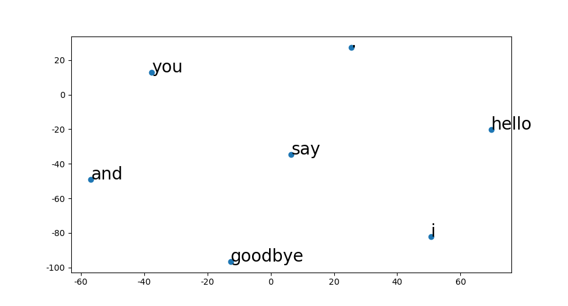

## <center>Homework Programming Assignment 9</center>

<center>Dohun Kim 2018115809</center>


#### Chapter 02. 자연어와 단어의 분산 표현

 Chapter 02 내용의 코드는 `hw9-1.py`로 통합되어있다.
```python
'''
hw9-1.py :
    Ch02. Natural Language and Distributional Representation
'''
```


##### 1-1) Preprocessing

```python
text = 'You say goodbye and I say hello.'
corpus, word_to_id, id_to_word = preprocess(text)

print(f'corpus: {corpus}')          # f: {corpus} 를 변수 corpus 로 매핑
print(f'id_to_word: {id_to_word}')  # f: {id_to_word} 를 변수 id_to_word 로 매핑
```

```
corpus: [0 1 2 3 4 1 5 6]
id_to_word: {0: 'you', 1: 'say', 2: 'goodbye', 3: 'and', 4: 'i', 5: 'hello', 6: '.'}
```

##### 1-2) Co-occurrence Matrix

```python
window_size = 1  # 주변 1개
vocab_size = len(id_to_word)

C = create_co_matrix(corpus, vocab_size, window_size)

print('Co-occurrence Matrix')
print(C)
print('-' * 50)

print(id_to_word[4], C[4]) # ID가 4인 단어의 벡터 표현

w = 'goodbye'
print(w, C[word_to_id[w]]) # "goodbye"의 벡터 표현
```

```
Co-occurrence Matrix
[[0 1 0 0 0 0 0]
 [1 0 1 0 1 1 0]
 [0 1 0 1 0 0 0]
 [0 0 1 0 1 0 0]
 [0 1 0 1 0 0 0]
 [0 1 0 0 0 0 1]
 [0 0 0 0 0 1 0]]
--------------------------------------------------
i [0 1 0 1 0 0 0]
goodbye [0 1 0 1 0 0 0]
```


##### 1-3) Cosine Similarity

```python
vocab_size = len(word_to_id)
C = create_co_matrix(corpus, vocab_size)

c0 = C[word_to_id['you']]  # "you"의 단어 벡터
c1 = C[word_to_id['i']]  # 'i'의 단어 벡터
print(cos_similarity(c0, c1))
print('-' * 50)

most_similar('you', word_to_id, id_to_word, C, top=5)
```

```
0.7071067758832467
--------------------------------------------------
[query] you
 goodbye: 0.7071067758832467
 i: 0.7071067758832467
 hello: 0.7071067758832467
 say: 0.0
 and: 0.0
```


##### 1-4) Positive Pointwise Mutal Information

```python
W = ppmi(C)

print('PPMI')
print(W)
print('-' * 50)

most_similar('you', word_to_id, id_to_word, W, top=5)
```

```
PPMI
[[0.    1.807 0.    0.    0.    0.    0.   ]
 [1.807 0.    0.807 0.    0.807 0.807 0.   ]
 [0.    0.807 0.    1.807 0.    0.    0.   ]
 [0.    0.    1.807 0.    1.807 0.    0.   ]
 [0.    0.807 0.    1.807 0.    0.    0.   ]
 [0.    0.807 0.    0.    0.    0.    2.807]
 [0.    0.    0.    0.    0.    2.807 0.   ]]
--------------------------------------------------
[query] you
 goodbye: 0.40786147117614746
 i: 0.40786147117614746
 hello: 0.2763834297657013
 say: 0.0
 and: 0.0
```


##### 1-5) Singular Value Decomposition

```python
U, S, V = np.linalg.svd(W)

print(C[0])  # 동시발생 행렬
print(W[0])  # PPMI 행렬
print(U[0])  # SVD

# visualization
for word, word_id in word_to_id.items():
    plt.annotate(word, (U[word_id, 0], U[word_id, 1]))
plt.scatter(U[:,0], U[:,1], alpha=0.5)
plt.show()
print('-' * 50)
```

```
[0 1 0 0 0 0 0]
[0.    1.807 0.    0.    0.    0.    0.   ]
[-3.409e-01 -1.110e-16 -3.886e-16 -1.205e-01  0.000e+00  9.323e-01  2.226e-16]
```


##### 2) PTB Dataset


#### Chapter 03. Word2Vec

 Chapter 03의 내용은 `hw9-2.py`로 통합되어있다.

```python
'''
hw9-2.py :
    Ch03. Word2Vec, CBOW, Skipgram
'''
```


| SimpleCBOW | SimpleSkipGram |
| ------------------------- | --------------------------- |
|  |  |
|  |  |

