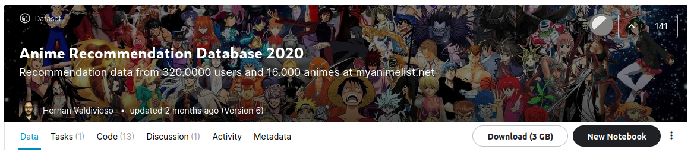

<h2><center>Anime Genre Classification</center></h2>
<center>Final Project</center>
<center>Dohun Kim 2018115809</center>

#### 0. Index

1. Problem Statement
2. Data Generation
3. Data Preprocessing
4. Model Design
5. Conclusion
6. Description of Submission Code


#### 1. Problem Statement

##### 1-1. Predicting Genres of Anime from Synopsis


##### 1-2. Multi-Label Classification


#### 2. Data Generation

##### 2-1. Original Dataset on Kaggle



 처음에 최종 프로젝트로 선정하였던 데이터셋은 Kaggle의 `Anime Recommendation Database 2020` 입니다. 이 데이터셋은 애니메이션 정보 사이트인 `MyAnimeList.net`으로부터 수집된 애니메이션과 사용자에 대한 정보를 포함합니다. 따라서 데이터셋의 이름과 같이 사용자별 선호도에 따른 애니메이션 추천 모델을 만드는 데에 주로 사용됩니다.

 총 3GB 가량의 방대한 용량의 데이터 중 대부분은 유저별 애니메이션 점수 평가에 관한 것이며, 각 애니메이션 자체에 대한 정보는 `anime.csv`, `anime_with_synopsis.csv` 두개로 약 12MB에 그칩니다. 30MB 용량 제한이 주어진 이번 프로젝트에서는 이 두 파일만은 사용하여 애니메이션의 줄거리를 입력받았을 때, 그 애니메이션의 장르를 구분하는 모델을 만들어보고자 하였습니다.

- Original Dataset on Kaggle
  
- Correct Data
  


 하지만, 코드 작업 진행 중 해당 데이터셋의 줄거리 데이터는 위의 그림과 같이 일부 단어들의 글자가 소실되어있다는 문제점을 발견하였습니다. Kaggle에서 이 데이터셋을 대체할만한 새로운 데이터셋이 마땅하지 않았으며, 이 시점까지 작업이 많이 진행되어있었기 때문에, 자체 데이터셋을 직접 생성해서 사용하기로 결정하였습니다.


##### 2-2. Web Scrapping

 `MyAnimeList.net`의 웹페이지 데이터를 수집하기 위해서는, 사이트 보안 차원의 IP 밴 조치를 우회하기 위해 4~7초 정도의 시간 간격이 필요합니다. 총 17000여개의 애니메이션의 상세정보 페이지를 모두 수집하기 위해서는 적어도 24시간이 필요한 작업입니다. 다행히 위 Kaggle 데이터셋의 제작자가 데이터셋을 생성할 때 수집된 모든 원본 html 데이터를 Google Drive 링크를 통해 공유하고 있기 때문에, 이를 활용하여 직접 웹스크래핑을 오랜 시간동안 실행하지 않고 바로 자체 데이터셋 생성을 시작할 수 있었습니다.

###### get_html.ipynb


 Ubuntu 명령어 `curl`을 통해 원본 데이터셋 제작자의 Google Drive 링크로부터 압축 파일을 다운로드하고 압축 해제하여 모든 html 파일들을 저장합니다. 이 노트북을 실행한 후에는 다음과 같이 모든 html 파일들을 포함한 `html` 디렉터리가 생성됩니다.

```
anime-genre-classification/
├─ gen_data/
│  ├─ html/
|  │  ├─ 1.html
|  │  ├─ 5.html
|  │  ├─ ...
│  ├─ generate_data.ipynb
│  ├─ get_html.ipynb
├─ ...
```


##### 2-3. HTML Parsing


###### generate_data.ipynb

웹 브라우저의 개발자 도구 기능을 통해 html 코드에서 필요한 부분을 찾고, 그 값을 html로부터 `beautifulsoup4` 라이브러리를 통해 추출합니다. 이 노트북을 실행한 후에는 기존의 `html` 디렉터리가 삭제되고 필요한 모든 데이터를 정리한 `anime.csv` 가 생성됩니다.

```
anime-genre-classification/
├─ gen_data/
│  ├─ html/
│  ├─ anime.csv
│  ├─ generate_data.ipynb
│  ├─ get_html.ipynb
├─ ...
```


* generate_data.ipynb (일부분)


* anime.csv (과제 선정 데이터셋)


#### 3. Data Preprocessing

##### 3-1. Load Data from Github

###### clean_data.ipynb


 앞서 **2. Data Generation** 에서 생성한 `anime.csv` 는 Github를 통해 공개되어 있으며, Ubuntu의 `wget` 명령어를 통해 웹에서 다운로드하여 데이터를 사용합니다. 데이터를 받은 후, 데이터셋에 포함된 애니메이션들 중 Type이 Unknown이거나 ONA인 애니메이션을 제외합니다. 이는 Type이 명시되어있지 않거나 인터넷 애니메이션으로, 이번 문제의 범위에 속하지 않습니다. 그 후 모든 데이터에 대해 결측치, 즉 비어있는 값이 존재하는 행을 제외하였습니다.

###### clean_data.ipynb


* 애니메이션의 구분

| | Type  | Description |
|---|-------|---------------|
|	|TV     |TV 방영 애니메이션|
| |Movie  |극장판 애니메이션|
| |Special    |행사/특전 제공 애니메이션|
| |OVA    |Original Video Animation, DVD/BD를 통해서만 판매되는 애니메이션  |
| |ONA| Original Net Animation, 인터넷을 통해서만 공개되는 애니메이션 |

 


##### 3-2. Remove Unusable Synopsis


 MyAnimeList.net 에서 수집한 줄거리 정보 중 위의 경우와 같이 실제 줄거리가 아닌 작품 자체의 정보에 해당하는 경우가 상당수 존재합니다. 예를 들어 "줄거리 정보가 없습니다."라던가 "-의 후속작입니다." 등 작품 외적인 정보를 기술하는 경우 학습 대상에서 제외하였습니다.

###### clean_data.ipynb


##### 3-3. Text Cleaning


 줄거리 데이터에 CBOW 등의 Word2Vec 모델을 적용하기 위해서는 먼저 줄거리 텍스트를 정리해 줄 필요가 있습니다. 소문자로 만들기, 특수문자 제거하기, 불용어 제거하기, PTB 데이터셋에 없는 어휘 제거하기를 순서대로 진행하였습니다. 

###### clean_data.ipynb


 줄거리 텍스트로 부터 불용어를 처리하기 위해서 `stopwords-iso` 에서 제공하는 영어의 불용어 리스트를 공식 Github repo에서 `wget` 명령을 통해  위와 같이 웹에서 다운로드하여 사용하였습니다.

###### clean_data.ipynb


 또한 교재의 Github repo에서 제공하는 PTB 데이터셋에 사전 학습된 CBOW 모델 파라미터 pickle 파일 또한 `wget` 명령을 통해 위와 같이 웹에서 다운로드하여 어휘 집합을 사용하였습니다.


#####  3-4. Synopsis to Vector

 강의 내용을 에서 배운 Word2Vec의 CBOW, Skipgram의 경우 한 단어를 고정된 길이의 벡터로 변환하고, RNNLM의 경우 이전 단어로부터 다음 단어를 예측하므로, 전체 문장이 표현하는 장르를 예측하는 모델을 만들기 어려울 것이라고 판단하였습니다. 여기서 Word2Vec에서와 같이 한 줄거리 텍스트 전체를 하나의 고정 길이 벡터에 대응시키는 방법을 떠올리게 되었습니다. 한 문장 내의 각 단어들의 Word2Vec의 평균으로 해당 문장에 대응하는 문장 벡터를 만들어낼 수 있으며, 단순 평균이 아닌 TF-IDF라는 값을 가중치로써 곱하여 평균을 구하면 더 효과적임을 알게되었습니다.

###### TF-IDF

 Term Frequency - Inverse Document Frequency의 약자로, TF와 IDF의 곱으로 구해집니다. TF는 특정 문서 d에서의 특정 단어 t의 등장 횟수이며, IDF는 특정 단어 t가 등장한 문서의 수에 반비례하는 수입니다. TF-IDF는 모든 문서에서 자주 등장하는 단어는 중요도가 낮다고 판단하며, 특정 문서에서만 자주 등장하는 단어는 중요도가 높다고 판단합니다. TF-IDF 값이 낮으면 중요도가 낮은 것이며, TF-IDF 값이 크면 중요도가 큰 것입니다.

###### synopsis_vector.ipynb


#### 4. Model Design

##### 4-1. MLP with Transfer Learning


 애니메이션 장르 분류를 위한 모델을 위의 그림과 같이 설계하였습니다. 먼저 앞서 본 것과 같이 TF-IDF를 곱한 Word2Vec의 평균으로 줄거리에 대한 고정 길이 벡터(줄거리 벡터)를 생성하는 고정된 모델과, 이 줄거리 벡터를 바탕으로 장르를 예측하는 학습 가능한 다층 퍼셉트론 모델의 조합으로, 특징 추출을 위해 전이 학습을 사용하는 것이라고 해석할 수 있습니다.


##### 4-2. Issue 1: Multi-Label Classification
 모델을 작성하는 과정에서 첫번째로 만난 난관은 풀려고 하는 문제가 Multi-Class 분류가 아닌 Multi-Label 분류 문제라는 것입니다. Multi-Class 분류 문제는 정답이 단 한개 존재하는, 즉 one-hot 벡터로 표현되는 경우를 말하며, Multi-Label 분류 문제는 정답이 여러개 존재할 수 있는 문제입니다.


|                for Multi-Class Classification                |                for Multi-Label Classification                |
| :----------------------------------------------------------: | :----------------------------------------------------------: |
| $$ \begin{align} \hat{y_i}&=\mathrm{softmax}(x_i)\\ \mathrm{CCELoss}&=-\sum_i {y_i \log(\hat{y_i})}\\ \end{align} $$ | $$ \begin{align} \hat{y_i}&=\mathrm{sigmoid}(x_i)\\ \mathrm{BCELoss}(\hat{y_i}, y_i)&=-\left( y_i \log(\hat{y_i}) + (1-y_i) \log(1-\hat{y_i}) \right)\\ \mathrm{Total\ Loss}&=\sum_i \mathrm{BCELoss}(\hat{y_i}, y_i) \end{align} $$ |

 Multi-Label 분류에서는 기존에 Multi-Class 분류에 사용하던 Softmax와 Categorical Cross Entropy Loss의 조합은 사용할 수 없습니다. 그 대신 각각의 label에 대해서 0/1 여부를 예측하는 Binary 분류를 수행하는 것으로 생각할 수 있습니다. 따라서 활성화 함수로 Softmax 대신 Sigmoid를 사용하고, 손실 함수로 Label별 Binary Cross Entropy의 합을 사용할 수 있습니다. 

 이 경우 모델의 출력은 각 label에 대해 해당 label이 1일 확률이며, 따라서 0.5와 같은 경계값을 기준으로 확률값으로부터 0 또는 1을 결정할 수 있습니다.


##### 4-3 Issue 2: Class Imbalance


 두번째로 만난 난관은 매우 큰 클래스의 불균형입니다. 위의 그림은 전체 애니메이션에 대한 장르의 분포입니다. 이러한 불균형이 큰 데이터를 그대로 학습에 사용하였을 때는 데이터의 수가 많은 몇개의 장르가 나머지를 압도하여 제대로 학습이 진행되지 않았습니다.

 이 문제에 대한 해결 방안으로 먼저 데이터를 조작하여 모든 장르의 비율을 맞추어 주는 방법이 있습니다. 개수가 많은 장르를 개수가 적은 장르에 맞추어 사용하는 under sampling이나, 개수가 많은 장르에 개수가 적은 장르를 반복하여 맞추는 over sampling 등이 있는데, 데이터의 양이 충분하지 않고 양의 차이가 너무 크게 나서 사용하기 곤란한 방법이었습니다.

 다음으로는 손실 함수를 변경하여 해결하는 방법이 있습니다. 앞서 확인했던 Binary Cross Entropy Loss에 label별로 가중치를 다르게 두는 Weighted BCELoss와, 각 label에 focal modulation factor를 곱하는 Focal Loss 등을 사용하면 클래스 불균형 문제를 해결할 수 있는데, 구현의 난이도와 이론적 정밀성을 검토하여 Focal Loss를 사용하기로 정하였습니다.


##### 4-4. Focal Loss

 Focal Loss에 대한 정확한 정의와 미분식을 확인하기 위해 arXiv에 게재된 논문 ***Focal Loss for Dense Object Detection*** 을 읽고 정리하였습니다. 
$$
\begin{align}
\mathrm{CE}(p_t)&=-\log(p_t)\\
\mathrm{FL}(p_t)&=-(1-p_t)^\gamma\log(p_t)\\
\end{align}

\qquad\qquad 
p_t=
\begin{cases}
	p, & \text{if }\ y=1 \\
	1-p, & \text{otherwise}
\end{cases}
$$

 Focal Loss는 object detection 시나리오에서 훈련 중에 극단적인 클래스 불균형이 존재할 경우를 위해 만들어졌습니다. 기존의 일반적인 방법은 Cross Entropy에 weight를 도입한 Balanced Cross Entropy인데, Focal Loss는 여기서 Cross Entropy에  weight 대신 modulating factor $(1-p_t)^\gamma$를 도입합니다. 이는 훈련 중에 쉬운 label의 가중치를 낮추어, 손실 함수가 어려운 label에 좀 더 집중할 수 있게 해줍니다. 

| anime_classification.py         |                                 |
| :------------------------------ | ------------------------------- |
|  |  |

###### model.ipynb


#### 5. Conclusion

##### 5-1. Result

 앞장의 그림과 같이 train loss와 validation loss가 함께 줄어들어 그래프 상 학습이 잘 된 것처럼 보이지만, 모델의 실제 prediction의 정확도는 매우 좋지 않습니다. 아래는 test dataset의 줄거리 벡터를 입력했을 때 모델의 출력을 높은 순으로 정렬하고, 해당 label에 대한 참값을 병기한 것입니다. 

|    ex1 ($\gamma=2$)    |    ex2 ($\gamma=2$)    |    ex3 ($\gamma=6$)    |    ex4 ($\gamma=6$)    |
| :--------------------: | :--------------------: | :--------------------: | :--------------------: |
|  |  |  |  |

 출력값으로 나온 각 label들의 확률을 살펴보면 대부분 장르의 분포 비율이 그대로 나오며, 50%가 넘는 label이 거의 나오지 않음을 확인할 수 있습니다. Focal Loss의 Focal Parameter($\gamma$)의 매우 값을 크게 하여 억지로 출력값의 크기를 비슷하게 맞추어줄 수 있으나, 실제 정답과는 상관없이 단순히 비율만 맞추어지게 되어 의미있는 결과가 아님을 확인했습니다.


##### 5-2. Review

 모델의 예측 정확도를 개선하기 위해 매우 다양한 시도를 해보았지만 끝내 성공하지 못했습니다. 앞서 설명한 방법 이외에 시도해보았던 방법들을 몇가지 나열하면 다음과 같습니다.

1. 장르들 간의 종속성을 고려해 통합하여 장르의 총 가짓수 줄이기
2. 각 장르를 word vector로 표현하여 유사도를 기반으로 학습하기
3. 더 큰 데이터셋으로 사전 학습된 Word2Vec 모델 사용해보기
4. 줄거리 벡터 생성할 때 TF-IDF 가중치 생략하기
5. TF-IDF 중요도가 가장 높은 n개의 word vector만의 평균으로 줄거리 벡터 생성하기
6. 전체 장르 데이터로부터 장르 벡터를 만드는 Autoencoder를 만들어 label로 사용하기
7. Focal Loss 대신 MSE Loss를 통해 회귀문제로 풀어보기
8. 출력 확률이 해당 데이터 분포 비율보다 크면 1로 predict하도록 후처리하기

 많은 노력을 기울였음에도 기대했던만큼의 결과물이 완성되지 않아 실망스럽긴 하지만, 자연어 처리, 멀티 레이블 분류 등 기존에 해보지 못했던 분야로 주제를 정했던 만큼 이번 최종 프로젝트를 진행하면서 상당히 많은 새로운 것을 배울 수 있었습니다. 이 주제는 지능시스템설계 과목의 프로젝트로 끝내지 않고 앞으로 개인 프로젝트로 Github와 Kaggle에서 계속 진행하게 될 것 같습니다. 


#### 6. Description of Submission Code

###### 압축 파일 내부 구조

```
submission.zip/
├─ anime_classification.py
├─ clean_data.ipynb
├─ model.ipynb
├─ ptb.py
├─ synopsis_vector.ipynb
```

###### 실행 순서

1. `clean_data.ipynb` : 데이터 다운로드 및 전처리
2. `synopsis_vector.ipynb` : 텍스트 데이터를 문장 벡터로 변환
3. `model.ipynb` : 모델 생성 및 학습 실행

###### 부가 설명

- `ptb.py` : 교재 제공 코드,  PTB 데이터셋 어휘 집합 불러올 때 사용
- `anime_classification.py` : 함수, 커스텀 레이어, 커스텀 모델 정의 포함
