## <center>Homework Programming Assignment 8</center>

<center>Dohun Kim 2018115809</center>


#### 1. MNIST

```python
(x_train, t_train), (x_test, t_test) = load_mnist(flatten=False)

network = DeepConvNet()
trainer = Trainer(network, x_train, t_train, x_test, t_test,
                  epochs=20, mini_batch_size=100,
                  optimizer='Adam', optimizer_param={'lr':0.001},
                  evaluate_sample_num_per_epoch=1000)
trainer.train()
```

 위의 코드는 강의자료의 예제 코드에서 사용한 하이퍼파라미터 값들이다. 기존 코드를 따라 그대로 실행하면 전체 mnist 데이터셋에 대해 학습하는데, 이는 훈련에 매우 긴 시간이 소요된다. 따라서 주석처리되어있던 데이터 수 줄이는 코드를 통해 5000개의 데이터만을 사용하기로 했다. 그럼에도 불구하고 실행 시간이 상당히 길었고, 대략 10번째 epoch 이후부터는 의미있는 성능 향상이 이루어지지 않음을 확인하였다. 따라서 epoch 수를 절반인 10번으로 줄여서 다음과 같이 과제를 수행하였다.


```python
(x_train, t_train), (x_test, t_test) = load_mnist(flatten=False)

# 시간이 오래 걸릴 경우 데이터를 줄인다.
x_train, t_train = x_train[:5000], t_train[:5000]
x_test, t_test = x_test[:1000], t_test[:1000]

network = DeepConvNet()
trainer = Trainer(network, x_train, t_train, x_test, t_test,
                  epochs=10, mini_batch_size=100,
                  optimizer='Adam', optimizer_param={'lr':0.001},
                  evaluate_sample_num_per_epoch=1000,
                  verbose=False)
trainer.train()
```


| 10 epochs - test acc: 96.96% | 20 epochs - test acc: 97.34% |
| ------------------------- | --------------------------- |
| 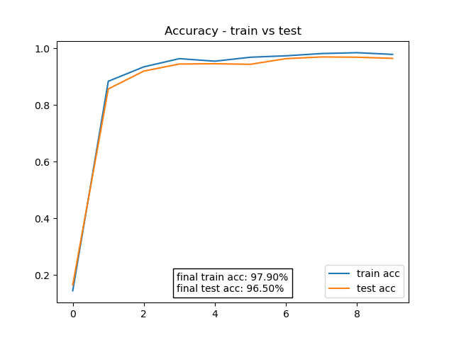 | 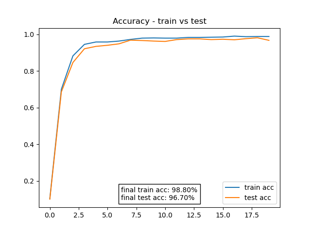 |


| 10 epochs - test acc: 96.96% | 20 epochs - test acc: 97.34% |
| ------------------------- | --------------------------- |
| 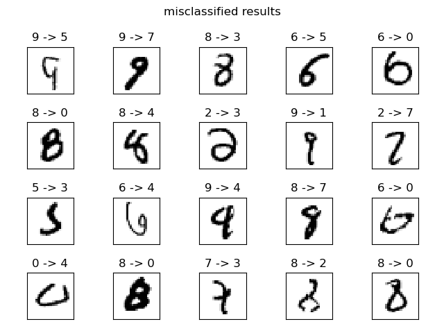 | 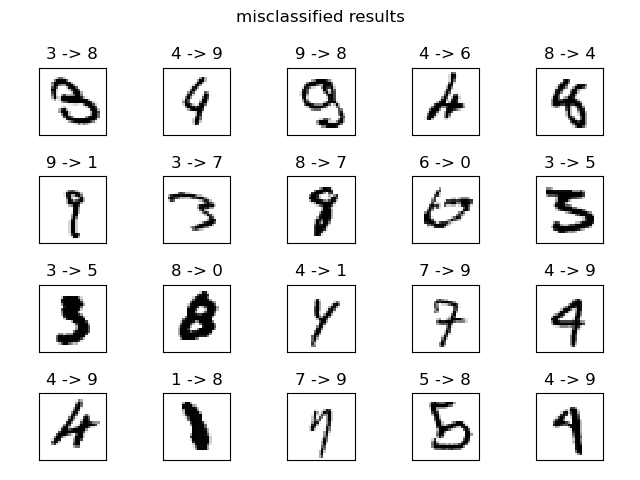 |

 위의 학습 곡선에서 3, 4번째 epoch 이후로 성능의 개선이 크게 이루어지지 않는 점에서 학습률을 더 크게 만들어 0.002, 0.004의 값으로 시도해보았다. 결과 학습률이 0.002일 때 가장 최적의 학습이 됨을 확인할 수 있었다.


| lr: 0.002 - test acc: 97.63% | lr: 0.004 - test acc: 96.93% |
| ------------------------- | --------------------------- |
| 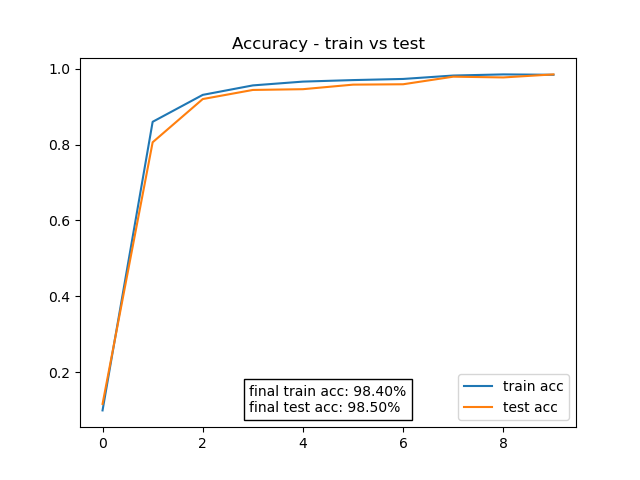 | 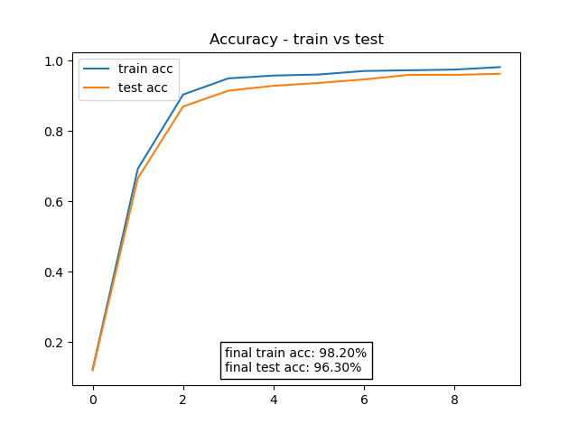 |
| 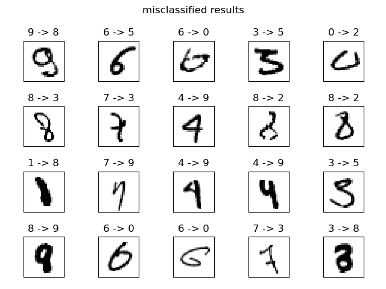 | 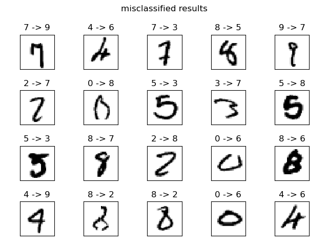 |


#### 2. Fashion MNIST

 Fashion MNIST에 대해서도 앞서 MNIST에서와 마찬가지로 5000개의 데이터에 대해서 10번과 20번의 epoch에 대해서 훈련을 진행해보았다. 

```python
(x_train, t_train), (x_test, t_test) = load_fashion_mnist(flatten=False)

# 시간이 오래 걸릴 경우 데이터를 줄인다.
x_train, t_train = x_train[:5000], t_train[:5000]
x_test, t_test = x_test[:1000], t_test[:1000]

network = DeepConvNet()

trainer = Trainer(network, x_train, t_train, x_test, t_test,
                  epochs=10, mini_batch_size=100,
                  optimizer='Adam', optimizer_param={'lr':0.001},
                  evaluate_sample_num_per_epoch=1000,
                  verbose=False)
```


| 10 epochs - test acc: 83.5% | 20 epochs - test acc: 85.4% |
| ------------------------- | --------------------------- |
| 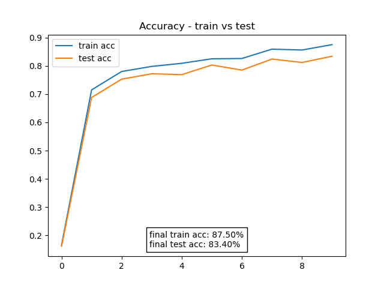 | 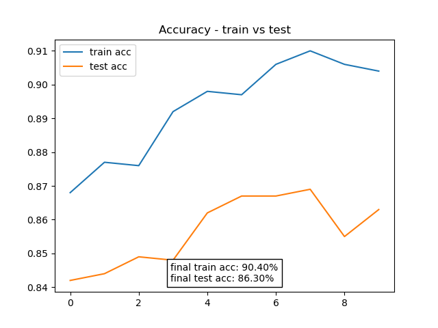 |
| 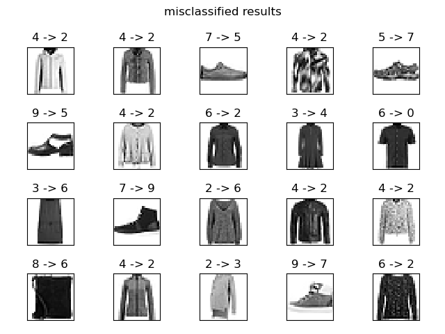 | 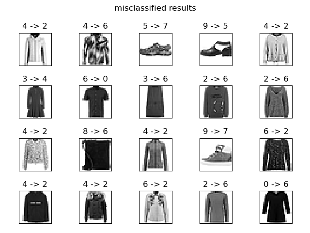 |


 더 큰 학습률 0.002에 대해서도 훈련을 진행해보았지만 오히려 성능이 낮아졌다. 따라서 결과적으로 기존의 학습률 0.001을 그대로 사용하기로 했다.

| lr: 0.002 - test acc: 82.66% | |
| ------------------------- | --------------------------- |
| 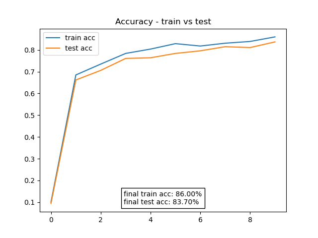 | 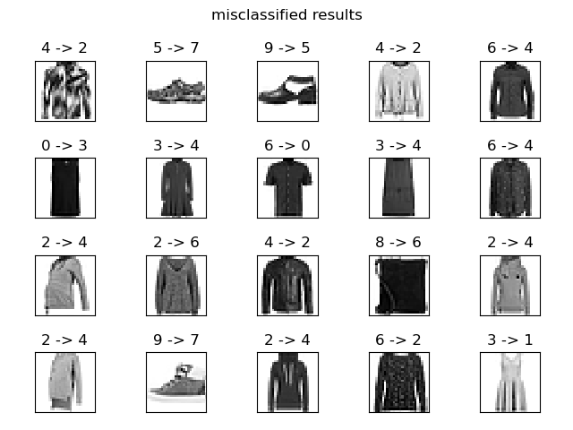 |
